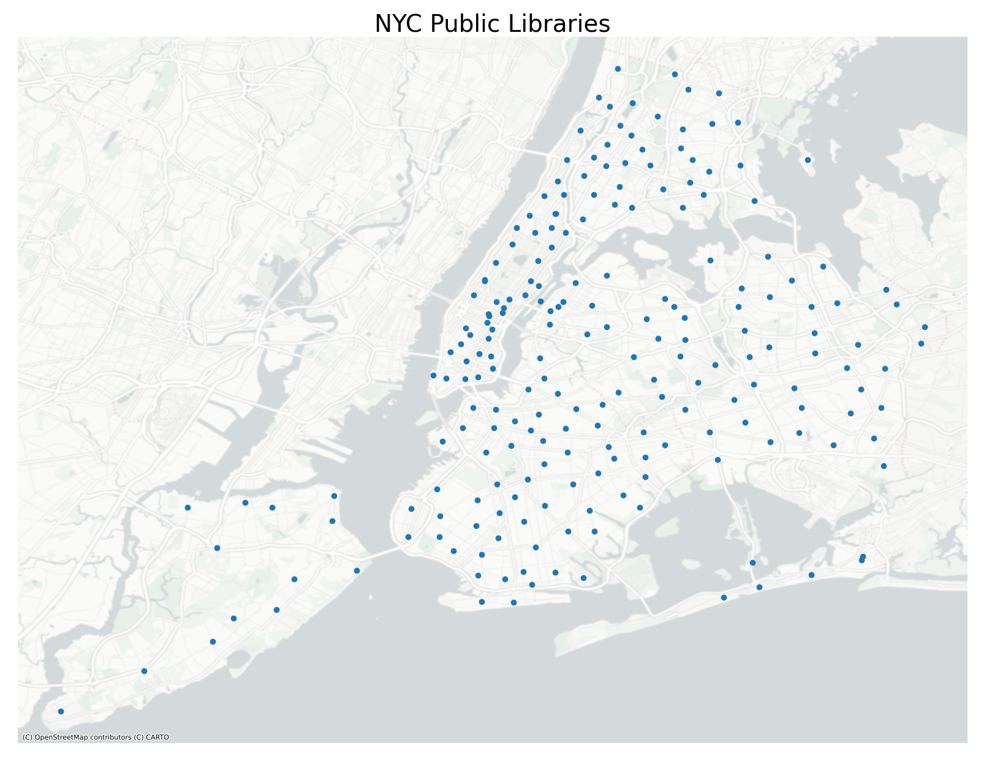
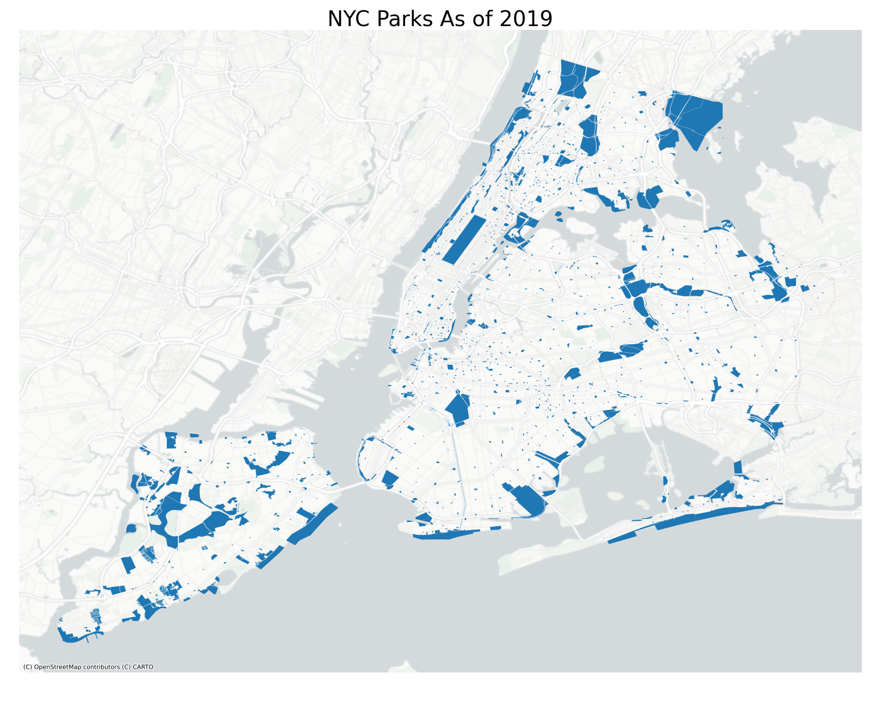

# NYC Complaint Data 2019
## By Dillon Turner
34:970:651:01
Command-Line GIS
Fall 2022

This project explores New York City's NYPD complaint data for the year 2019, along with several characteristics of New York City that may be potentially linked to New York's crime rate. NYPD complaint data contains geo-located complaints, or crimes, reported to the New York Police Department going back to 2006. However, this study will exclusively focus on all complaints reported in 2019. There are two main reasons to focus on one specific year: one, the boundaries relating to census data are time sensitive, meaning every ten years when redistricting occurs the boundaries for these areas shifts. So, it is best to keep within one of these ten-year spans, i.e., 2000-2009, 2010-2019, etc., for consistency. Two, the built environment in any city is constantly shifting and it is difficult to find historic building footprints that are mapped, and in with respect to NYC, only the most recent building information is easily accessible on the NYC Open Data portal. Additionally, since the COVID-19 pandemic started, crime has seemingly been more aggressive and prevalent in NYC and around the country, so studying crimes from 2020 forward would be less significant compared to the trends seen from 2000-2019, though it’s entirely possible this is the new normal. Separately, mapping these data are computationally intensive and time consuming, so limiting the dataset to this degree is optimal.
The built environment means human-made structures and networks that surround us. This includes buildings, streets, items on streets including signage, benches, streetlights, and in many major cities: parks, trees, other greenery, and recreational areas. The presence of these latter objects is increasingly being studied to see how they affect city residents’ well-being mentally, physically, and socially. Current literature suggests that the stronger the presence of these objects in a community, the more likely its residents are to be physically, mentally, and socially healthy. Additional research has looked at how these elements are affecting crime and residents’ perception of crime in their neighborhood. Specifically, the theory of crime prevention through environment design (CPTED) suggests that the more a neighborhood is socially connected, socially engaged, open, well-lit at night, and green then there is less likely to be crime and a fear of crime by residents. There have been three generations of CPTED since the 1960s-1970s. The first generation exclusively focused on open streets and well-lit neighborhoods.  However, the product was more like a dungeon than a neighborhood. Streets would have bright lights, no fences, no bushes, no trees, nor anything else that can obstruct a person’s view, and doors and windows would be barred for security. Second generation CPTED included these elements but also shifted focus to getting the community involved to report any crime. But this didn’t turn out as planned as people were not exactly taught what to do or how to engage in these environments. The third and current generation mixes the previous generations while also focusing on livability and sustainability. This means making neighborhoods green and pleasant places to sit around or exercise in, to take in the outdoors and convene with your neighbors, building a sense of provide in your community while also being vigilant to any crime.
Several datasets were utilized in this study, aiming to capture some of the elements in crime prevention through environmental design. All datasets were created by either New York City’s city government or the Census Bureau. Specifically, the population data and census block group boundaries utilized come from the Census Bureau. The population data was gathered using the Census’ API, the block groups were downloaded in as a shapefile, though they could have been collected using the API as well. Neither of these needed any adjustments or had problems, although the population data was aggregated into four categories. Initially imported as population totals by sex and age group, it was then aggregated into the following groups: children (ages: 0-17, females and males), young adults (ages: 18-29, female and male), adults (ages: 30-59, female and male), and elder adults (ages: 60 and over, female and male). Below are four graphics displaying the proportions of each age group within each census block group for all of New York City. The hatched-white areas are where the coefficient of variances is above 40, signaling the data is unreliable for those areas. While population density is not exactly a traditional variable to detect crime, in this scenario it is being used to find where different age groups reside and if overcrowding exists and may exacerbate crime. 

Next, NYC’s borough boundaries were used to make clean clippings for each block group. This was available as a shapefile.  Typically, census data includes waterfront data as well, however for this analysis that data is less relevant and diminishes the aesthetic of the graphics. So, the boundaries file is used to clip the block groups. This comes from New York City’s Open Data portal. Also from the portal, are the city’s public library locations and park, greenspace, and recreational area boundaries. These are available as geojson files.  

Several studies have mentioned parks and greenspaces with relation to crime, and one study specifically looks at how libraries affect crime in the local area. Outcomes of the park studies have been mixed to inconclusive, ranging from parks exacerbating crime to having no effect at all. While one library study, which inspired this analysis, found that the construction of a public library in Kansas City, MO deterred crime in its immediate vicinity, but has diminishing effects the further away you moved. The study being carried out now could have been improved through a better analysis around these areas. Initially, the goal was to use a network analysis around each library and park to detect if a crime fell within a 5-10-15 minute walking distance. However, many technical difficulties were encountered, and time was a limiting factor. Instead, Euclidian buffers were created around each park using 1-2-3 block radii and 1-4-8 block buffers around libraries. Previous studies used similar intervals. Crimes were aggregated by if they fell within these distances. If a crime was less than a block away, it would be counted in all three buffers, which was a poor choice. Instead, the buffers should have only covered within one block, the second buffer should have covered all crimes that were two to four blocks away, and the third buffer should have covered all crimes five to eight blocks away. The same methodology should have been used for the park distances. 
City lot data was collected and analyzed. This came from NYC’s Department of City Planning. The dataset contains many features for each city lot in NYC, many of which are tax related. This study used elements such as number of buildings on each lot, number of units, number of residential units, total building square footage across all floors, square footage for residential use, square footage for commercial use, square footage for industrial use, parking square footage, the number of vacant buildings on the lot, number of buildings for mixed use (residential and commercial), and different building types such as single or two family homes, multi-family buildings that are walk-ups or contain an elevator. Each lot has its geometry and shape saved in the file for plotting purposes. This is available as a shapefile. 

Lastly, is the complaint data provided by the NYPD and available through New York City’s Open Data portal. This file contains the geographic coordinates of each crime, when the crime was reported, which precinct responded to the crime, a description of the victim and suspect, a description of the crime meeting general categories and department level description for each crime (typically more descriptive). Part of the goal of this whole project was to aggregate all this data, form a finalized dataset, and use machine learning classifiers to see how accurately they can predict each individual crime’s type based on its surroundings. Crimes were generalized in two different features: one, whether it was a violent or nonviolent crime; two, if it was a personal, property, or crime against society. There were two clear approaches to factoring in each crime’s surroundings. One, create a small buffer around each crime and aggregate any adjacent spatial data, from the previous sources mentioned. This however was difficult to execute as desired, because proportions of objects would be captured, and it is difficult to accurately divide its characteristics by that proportion. Two, aggregate all data to the census block group level and spatially join block groups to each crime within that block group. This seems reasonable as most NYC blocks are two to three square blocks with the except to a handful. So, the neighborhood of the crime is fully being captured and joined to each crime using this method. Ultimately, these variables were poor choices for the machine learning classifiers as they could not adequately predict crime type based on these characteristics. More in the vein of CPTED, I would have liked to use NYC’s tree map which contains the coordinate location of every tree in the city, and a street light layout would be influential (though this does not seem publicly available) However, the tree map dataset is in the millions and needs major adjustments to properly map the data. This is available as a CSV. 
Almost of the data was clean. There were instances where my methodology forced data issues, but those issues were easily remediated since the null values were from non-existent items in each census block group, which were filled with zeroes.    

Here's my sample website!

<iframe src="PropotionPersonalCrimes.html" height = "600" width = "600"></iframe>

You can explore this map [as its own web page here](ProportionPersonalCrimes.html).
